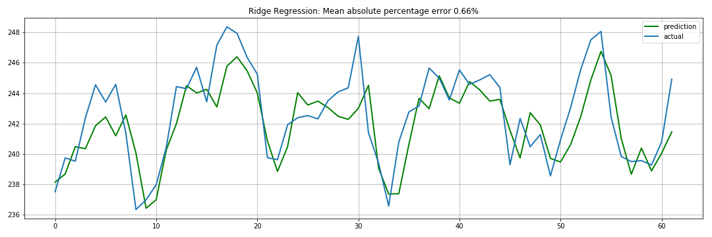

# AWS IoT Machine Learning

This repository contains my analysis of the University of California Irvine's [household electric power consumption dataset](http://archive.ics.uci.edu/ml/datasets/Individual+household+electric+power+consumption).

## Notebooks:

* [IoT_Household_Consumption.ipynb](https://github.com/collinprather/AWS-IoT-ML/blob/master/IoT_Household_Consumption.ipynb) consists of some preliminary data processing and exploratory visualization. My primary goal was to get a handle on Pandas' Timeseries functionalites

* In [IoT_ML.ipynb](https://github.com/collinprather/AWS-IoT-ML/blob/master/IoT_ML.ipynb), I experiment with some academic approaches to time series forecasting, like the Holt Winter's model below, as well as some machine learning approaches, like the Ridge Regression model also shown below. Each predictive model attempts to estimate the household voltage output.

* In [sagemaker.ipynb](https://github.com/collinprather/AWS-IoT-ML/blob/master/sagemaker.ipynb), I connect my sagemaker notebook instance to the S3 bucket containing the power consumption data, pull the the data from the bucket, process the data, split it into training and test sets, then channel that data into the model to be trained in the cloud. From there, I designate a location in the S3 bucket for the model predictions, and deploy the trained model. The diagram below represents a potential data pipeline that this sagemaker instance could belong to. All done on AWS free-tier.

